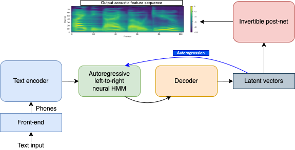

# OverFlow: Putting flows on top of neural transducers for better TTS
##### [Shivam Mehta][shivam_profile], [Ambika Kirkland][ambika_profile], [Harm Lameris][harm_profile], [Jonas Beskow][jonas_profile], [Éva Székely][eva_profile], and [Gustav Eje Henter][gustav_profile]

[arxiv_link]: https://arxiv.org/abs/2211.06892
[github_link]: https://github.com/shivammehta25/OverFlow
[shivam_profile]: https://www.kth.se/profile/smehta
[ambika_profile]: https://www.kth.se/profile/kirkland
[harm_profile]: https://www.kth.se/profile/lameris
[eva_profile]: https://www.kth.se/profile/szekely
[jonas_profile]: https://www.kth.se/profile/beskow
[gustav_profile]: https://people.kth.se/~ghe/
[HiFi_GAN_LJ_FT_V1_link]: https://github.com/jik876/hifi-gan#pretrained-model
[Neural_HMM_link]: https://shivammehta25.github.io/Neural-HMM/
[RyanSpeech_link]: https://arxiv.org/abs/2106.08468
[L2_arctic_link]: https://psi.engr.tamu.edu/l2-arctic-corpus/
[Indic-TTS_link]: https://www.iitm.ac.in/donlab/tts/index.php
[SLR70_link]: https://www.openslr.org/70/
[LibriTTS_British_link]: https://github.com/OscarVanL/LibriTTS-British-Accents
[coqui_tts_link]: https://github.com/coqui-ai/TTS

<head>
  <link rel="icon" type="image/x-icon" href="favicon.ico">
  <meta name="msapplication-TileColor" content="#da532c">
  <meta charset="UTF-8">
  <meta name="theme-color" content="#ffffff">
  <meta property="og:title" content="OverFlow: Putting flows on top of neural transducers for better TTS" />
  <meta name="og:description" content="This page presents listening examples for our new TTS model OverFlow, links to code, pretrained models, and our paper.">
  <meta property="og:image" content="images/social_preview.jpg" />
  <meta property="twitter:image" content="images/social_preview.jpg" />
  <meta property="og:type" content="website" />
  <meta property="og:url" content="https://shivammehta25.github.io/OverFlow/" />
  <meta property="og:site_name" content="OverFlow" />
  <meta name="twitter:card" content="images/social_preview.jpg" />

  <meta name="viewport" content="width=device-width, initial-scale=1.0">
  <meta name="keywords" content="tts, text to speech, machine learning, deep learning, speech synthesis, research, phd">
  <meta name="description" content="This page presents listening examples for our new TTS model OverFlow, links to code, pretrained models, and our paper." />
</head>

<style type="text/css">
  .tg {
    border-collapse: collapse;
    border-color: #9ABAD9;
    border-spacing: 0;
  }

  .tg td {
    background-color: #EBF5FF;
    border-color: #9ABAD9;
    border-style: solid;
    border-width: 1px;
    color: #444;
    font-family: Arial, sans-serif;
    font-size: 14px;
    overflow: hidden;
    padding: 0px 20px;
    word-break: normal;
    font-weight: bold;
    vertical-align: middle;
    horizontal-align: center;
    white-space: nowrap;
  }

  .tg th {
    background-color: #409cff;
    border-color: #9ABAD9;
    border-style: solid;
    border-width: 1px;
    color: #fff;
    font-family: Arial, sans-serif;
    font-size: 14px;
    font-weight: normal;
    overflow: hidden;
    padding: 0px 20px;
    word-break: normal;
    font-weight: bold;
    vertical-align: middle;
    horizontal-align: center;
    white-space: nowrap;
    padding: 10px;
    margin: auto;
  }

  .tg .tg-0pky {
    border-color: inherit;
    text-align: center;
    vertical-align: top,
  }

  .tg .tg-fymr {
    border-color: inherit;
    font-weight: bold;
    text-align: center;
    vertical-align: top
  }
  .slider {
  -webkit-appearance: none;
  width: 75%;
  height: 15px;
  border-radius: 5px;
  background: #d3d3d3;
  outline: none;
  opacity: 0.7;
  -webkit-transition: .2s;
  transition: opacity .2s;
}

.slider::-webkit-slider-thumb {
  -webkit-appearance: none;
  appearance: none;
  width: 25px;
  height: 25px;
  border-radius: 50%;
  background: #409cff;
  cursor: pointer;
}

.slider::-moz-range-thumb {
  width: 25px;
  height: 25px;
  border-radius: 50%;
  background: #409cff;
  cursor: pointer;
}

audio {
    width: 110px;
}
</style>

## Summary

We propose a new approach, **OverFlow**, to address the shortcomings of [neural HMM TTS][Neural_HMM_link] (a type of transducer TTS) by adding flows over them. Having a stronger probabilistic model, we can now describe the highly non-Gaussian distribution of speech acoustics, obtaining better likelihoods and resulting in improvements in pronunciation and naturalness. We show that our model converges to lower word error rate (WER) faster and achieves higher naturalness scores than comparable methods. The resulting system:
* Quickly learns to speak and align
* Is fully probabilistic
* Can generate good quality speech at many temperatures
* Can adapt to new speakers with limited data

Find reading boring? Try listening to the summary spoken by different voices:

<table class="tg">
  <thead>
    <tr>
      <th class="tg-fymr"><a href="https://keithito.com/LJ-Speech-Dataset/" style="color:white;">LJ Speech</a></th>
      <th class="tg-fymr"><a href="https://arxiv.org/abs/2106.08468" style="color:white;">RyanSpeech</a></th>
      <th class="tg-fymr"><a href="https://www.iitm.ac.in/donlab/tts/index.php" style="color:white;">IndicTTS (Female)</a></th>
      <th class="tg-fymr"><a href="https://www.iitm.ac.in/donlab/tts/index.php" style="color:white;">IndicTTS (Male)</a></th>
      <th class="tg-fymr"><a href="https://github.com/OscarVanL/LibriTTS-British-Accents" style="color:white;">L2 Arctic (Mandarin)</a></th>
    </tr>
  </thead>
  <tbody>
    <tr>
      <td>
        <audio id="audio-small" controls>
              <source src="./audio/OF/Summary/lj_summary.wav" type="audio/wav">
        </audio>
      </td>
      <td>
        <audio id="audio-small" controls>
              <source src="./audio/OF/Summary/ryan_summary.wav" type="audio/wav">
        </audio>
      </td>
      <td>
        <audio id="audio-small" controls>
              <source src="./audio/OF/Summary/indic_female_summary.wav" type="audio/wav">
        </audio>
      </td>
      <td>
        <audio id="audio-small" controls>
              <source src="./audio/OF/Summary/indic_male_summary.wav" type="audio/wav">
        </audio>
      </td>
      <td>
        <audio id="audio-small" controls>
              <source src="./audio/OF/Summary/mandarin_summary.wav" type="audio/wav">
        </audio>
      </td>
    </tr>
  </tbody>
</table>


For more information, please **[read our paper][arxiv_link]**.

## Architecture



## Code

Code is available in our [GitHub repository][github_link], along with pre-trained models.

It is also available in [Coqui TTS][coqui_tts_link] under text to spectrogram models. The training recipe can be found under `recipes/ljspeech/OverFlow`.

To synthesise from OverFlow present in [Coqui TTS][coqui_tts_link], you can use the following command:

```bash
# Install TTS
pip install tts
# Change --text to the desired text prompt
# Change --out_path to the desired output path
tts --text "Hello world!" --model_name tts_models/en/ljspeech/overflow --vocoder_name vocoder_models/en/ljspeech/hifigan_v2 --out_path output.wav
```

<!-- <script >
function playAudio(url) {
  new Audio(url).play();
  audio.play();
}


</script> -->
## Stimuli from the listening tests

<span style="font-weight: bold">Dataset:</span> [LJ Speech](https://keithito.com/LJ-Speech-Dataset/) <br>
<span style="font-weight: bold">Training data duration:</span> ~22.8 hours

<table class="tg">
  <thead>
    <tr>
      <th class="tg-0pky">Sentence</th>
      <th class="tg-0pky">Vocoded speech</th>
      <th class="tg-0pky" colspan="3">Proposed (OverFlow)</th>
      <th class="tg-0pky">Tacotron 2</th>
      <th class="tg-0pky">Glow-TTS</th>
      <th class="tg-0pky">Neural HMM TTS</th>
    </tr>
  </thead>
  <tbody>
    <tr>
      <th class="tg-fymr">Condition</th>
      <th class="tg-fymr">VOC</th>
      <th class="tg-fymr">OF</th>
      <th class="tg-fymr">OFND (No Dropout)</th>
      <th class="tg-fymr">OFZT (Zero Temperature)</th>
      <th class="tg-fymr">T2</th>
      <th class="tg-fymr">GTTS</th>
      <th class="tg-fymr">NHMM</th>
    </tr>
    <tr>
        <td nowrap class="tg-0pky">
            <span style="font-weight:bold">Sentence 1</span>
        </td>
        <td class="tg-0pky">
          <audio id="audio-small" controls>
            <source src="./audio/VOC/ListeningTest/1.wav" type="audio/wav">
          </audio>
        </td>
        <td class="tg-0pky">
          <audio id="audio-small" controls>
            <source src="./audio/OF/ListeningTest/1.wav" type="audio/wav">
          </audio>
        </td>
        <td class="tg-0pky">
          <audio id="audio-small" controls>
            <source src="./audio/OFND/ListeningTest/1.wav" type="audio/wav">
          </audio>
        </td>
        <td class="tg-0pky">
          <audio id="audio-small" controls>
            <source src="./audio/OFZT/ListeningTest/1.wav" type="audio/wav">
          </audio>
        </td>
        <td class="tg-0pky">
          <audio id="audio-small" controls>
            <source src="./audio/T2/ListeningTest/1.wav" type="audio/wav">
          </audio>
        </td>
        <td class="tg-0pky">
          <audio id="audio-small" controls>
            <source src="./audio/GTTS/ListeningTest/1.wav" type="audio/wav">
          </audio>
        </td>
        <td class="tg-0pky">
          <audio id="audio-small" controls>
            <source src="./audio/NHMM/ListeningTest/1.wav" type="audio/wav">
          </audio>
        </td>
    </tr>
    <tr>
        <td nowrap class="tg-0pky">
            <span style="font-weight:bold">Sentence 2</span>
        </td>
        <td class="tg-0pky">
          <audio id="audio-small" controls>
            <source src="./audio/VOC/ListeningTest/2.wav" type="audio/wav">
          </audio>
        </td>
        <td class="tg-0pky">
          <audio id="audio-small" controls>
            <source src="./audio/OF/ListeningTest/2.wav" type="audio/wav">
          </audio>
        </td>
        <td class="tg-0pky">
          <audio id="audio-small" controls>
            <source src="./audio/OFND/ListeningTest/2.wav" type="audio/wav">
          </audio>
        </td>
        <td class="tg-0pky">
          <audio id="audio-small" controls>
            <source src="./audio/OFZT/ListeningTest/2.wav" type="audio/wav">
          </audio>
        </td>
        <td class="tg-0pky">
          <audio id="audio-small" controls>
            <source src="./audio/T2/ListeningTest/2.wav" type="audio/wav">
          </audio>
        </td>
        <td class="tg-0pky">
          <audio id="audio-small" controls>
            <source src="./audio/GTTS/ListeningTest/2.wav" type="audio/wav">
          </audio>
        </td>
        <td class="tg-0pky">
          <audio id="audio-small" controls>
            <source src="./audio/NHMM/ListeningTest/2.wav" type="audio/wav">
          </audio>
        </td>
    </tr>
    <tr>
        <td nowrap class="tg-0pky">
            <span style="font-weight:bold">Sentence 3</span>
        </td>
        <td class="tg-0pky">
          <audio id="audio-small" controls>
            <source src="./audio/VOC/ListeningTest/3.wav" type="audio/wav">
          </audio>
        </td>
        <td class="tg-0pky">
          <audio id="audio-small" controls>
            <source src="./audio/OF/ListeningTest/3.wav" type="audio/wav">
          </audio>
        </td>
        <td class="tg-0pky">
          <audio id="audio-small" controls>
            <source src="./audio/OFND/ListeningTest/3.wav" type="audio/wav">
          </audio>
        </td>
        <td class="tg-0pky">
          <audio id="audio-small" controls>
            <source src="./audio/OFZT/ListeningTest/3.wav" type="audio/wav">
          </audio>
        </td>
        <td class="tg-0pky">
          <audio id="audio-small" controls>
            <source src="./audio/T2/ListeningTest/3.wav" type="audio/wav">
          </audio>
        </td>
        <td class="tg-0pky">
          <audio id="audio-small" controls>
            <source src="./audio/GTTS/ListeningTest/3.wav" type="audio/wav">
          </audio>
        </td>
        <td class="tg-0pky">
          <audio id="audio-small" controls>
            <source src="./audio/NHMM/ListeningTest/3.wav" type="audio/wav">
          </audio>
        </td>
    </tr>
    <tr>
        <td nowrap class="tg-0pky">
            <span style="font-weight:bold">Sentence 4</span>
        </td>
        <td class="tg-0pky">
          <audio id="audio-small" controls>
            <source src="./audio/VOC/ListeningTest/4.wav" type="audio/wav">
          </audio>
        </td>
        <td class="tg-0pky">
          <audio id="audio-small" controls>
            <source src="./audio/OF/ListeningTest/4.wav" type="audio/wav">
          </audio>
        </td>
        <td class="tg-0pky">
          <audio id="audio-small" controls>
            <source src="./audio/OFND/ListeningTest/4.wav" type="audio/wav">
          </audio>
        </td>
        <td class="tg-0pky">
          <audio id="audio-small" controls>
            <source src="./audio/OFZT/ListeningTest/4.wav" type="audio/wav">
          </audio>
        </td>
        <td class="tg-0pky">
          <audio id="audio-small" controls>
            <source src="./audio/T2/ListeningTest/4.wav" type="audio/wav">
          </audio>
        </td>
        <td class="tg-0pky">
          <audio id="audio-small" controls>
            <source src="./audio/GTTS/ListeningTest/4.wav" type="audio/wav">
          </audio>
        </td>
        <td class="tg-0pky">
          <audio id="audio-small" controls>
            <source src="./audio/NHMM/ListeningTest/4.wav" type="audio/wav">
          </audio>
        </td>
    </tr>
    <tr>
        <td nowrap class="tg-0pky">
            <span style="font-weight:bold">Sentence 5</span>
        </td>
        <td class="tg-0pky">
          <audio id="audio-small" controls>
            <source src="./audio/VOC/ListeningTest/5.wav" type="audio/wav">
          </audio>
        </td>
        <td class="tg-0pky">
          <audio id="audio-small" controls>
            <source src="./audio/OF/ListeningTest/5.wav" type="audio/wav">
          </audio>
        </td>
        <td class="tg-0pky">
          <audio id="audio-small" controls>
            <source src="./audio/OFND/ListeningTest/5.wav" type="audio/wav">
          </audio>
        </td>
        <td class="tg-0pky">
          <audio id="audio-small" controls>
            <source src="./audio/OFZT/ListeningTest/5.wav" type="audio/wav">
          </audio>
        </td>
        <td class="tg-0pky">
          <audio id="audio-small" controls>
            <source src="./audio/T2/ListeningTest/5.wav" type="audio/wav">
          </audio>
        </td>
        <td class="tg-0pky">
          <audio id="audio-small" controls>
            <source src="./audio/GTTS/ListeningTest/5.wav" type="audio/wav">
          </audio>
        </td>
        <td class="tg-0pky">
          <audio id="audio-small" controls>
            <source src="./audio/NHMM/ListeningTest/5.wav" type="audio/wav">
          </audio>
        </td>
    </tr>
    <tr>
        <td nowrap class="tg-0pky">
            <span style="font-weight:bold">Sentence 6</span>
        </td>
        <td class="tg-0pky">
          <audio id="audio-small" controls>
            <source src="./audio/VOC/ListeningTest/6.wav" type="audio/wav">
          </audio>
        </td>
        <td class="tg-0pky">
          <audio id="audio-small" controls>
            <source src="./audio/OF/ListeningTest/6.wav" type="audio/wav">
          </audio>
        </td>
        <td class="tg-0pky">
          <audio id="audio-small" controls>
            <source src="./audio/OFND/ListeningTest/6.wav" type="audio/wav">
          </audio>
        </td>
        <td class="tg-0pky">
          <audio id="audio-small" controls>
            <source src="./audio/OFZT/ListeningTest/6.wav" type="audio/wav">
          </audio>
        </td>
        <td class="tg-0pky">
          <audio id="audio-small" controls>
            <source src="./audio/T2/ListeningTest/6.wav" type="audio/wav">
          </audio>
        </td>
        <td class="tg-0pky">
          <audio id="audio-small" controls>
            <source src="./audio/GTTS/ListeningTest/6.wav" type="audio/wav">
          </audio>
        </td>
        <td class="tg-0pky">
          <audio id="audio-small" controls>
            <source src="./audio/NHMM/ListeningTest/6.wav" type="audio/wav">
          </audio>
        </td>
    </tr>
    <tr>
        <td nowrap class="tg-0pky">
            <span style="font-weight:bold">Sentence 7</span>
        </td>
        <td class="tg-0pky">
          <audio id="audio-small" controls>
            <source src="./audio/VOC/ListeningTest/7.wav" type="audio/wav">
          </audio>
        </td>
        <td class="tg-0pky">
          <audio id="audio-small" controls>
            <source src="./audio/OF/ListeningTest/7.wav" type="audio/wav">
          </audio>
        </td>
        <td class="tg-0pky">
          <audio id="audio-small" controls>
            <source src="./audio/OFND/ListeningTest/7.wav" type="audio/wav">
          </audio>
        </td>
        <td class="tg-0pky">
          <audio id="audio-small" controls>
            <source src="./audio/OFZT/ListeningTest/7.wav" type="audio/wav">
          </audio>
        </td>
        <td class="tg-0pky">
          <audio id="audio-small" controls>
            <source src="./audio/T2/ListeningTest/7.wav" type="audio/wav">
          </audio>
        </td>
        <td class="tg-0pky">
          <audio id="audio-small" controls>
            <source src="./audio/GTTS/ListeningTest/7.wav" type="audio/wav">
          </audio>
        </td>
        <td class="tg-0pky">
          <audio id="audio-small" controls>
            <source src="./audio/NHMM/ListeningTest/7.wav" type="audio/wav">
          </audio>
        </td>
    </tr>
  </tbody>
</table>


## Sampling at different temperatures

<span style="font-weight: bold">Dataset:</span> [LJ Speech](https://keithito.com/LJ-Speech-Dataset/) <br>
<span style="font-weight: bold">Training data duration:</span> ~22.8 hours


<div class="slidecontainer">
  <label for="myRange"><span style="font-weight:bold"> 0 </span></label>
  <input type="range" min="0" max="3" value="2" step="1" class="slider" id="myRange">
  <label for="myRange"><span style="font-weight:bold"> 1 </span> </label>
  <p><span style="font-weight:bold">Sampling temperature:</span> <span id="demo"></span>
  </p>
</div>
<table class="tg">
  <thead>
    <tr>
      <th class="tg-0pky">Sentence</th>
      <th class="tg-0pky">VOC</th>
      <th class="tg-0pky">OF</th>
      <th class="tg-0pky">OFND</th>
      <th class="tg-0pky">GTTS</th>
      <th class="tg-0pky">NHMM</th>
    </tr>
  </thead>
  <tbody>
    <tr>
      <td nowrap class="tg-0pky">
        <span style="font-weight:bold">Sentence 1</span>
      </td>
      <td class="tg-0pky">
        <audio controls>
          <source src="./audio/VOC/SamplingTemperature/1.wav" type="audio/wav">
        </audio>
      </td>
      <td class="tg-0pky">
        <audio controls id="OF_a_1">
          <source id="OF_s_1" src="./audio/OF/SamplingTemperature/1_667.wav" type="audio/wav">
        </audio>
      </td>
      <td class="tg-0pky">
        <audio controls id="OFND_a_1">
          <source id="OFND_s_1" src="./audio/OFND/SamplingTemperature/1_667.wav" type="audio/wav">
        </audio>
      </td>
      <td class="tg-0pky">
        <audio controls id="GTTS_a_1">
          <source id="GTTS_s_1" src="./audio/GTTS/SamplingTemperature/1_667.wav" type="audio/wav">
        </audio>
      </td>
      <td class="tg-0pky">
        <audio controls id="NHMM_a_1">
          <source id="NHMM_s_1" src="./audio/NHMM/SamplingTemperature/1_667.wav" type="audio/wav">
        </audio>
      </td>
    </tr>
    <tr>
      <td nowrap class="tg-0pky">
        <span style="font-weight:bold">Sentence 2</span>
      </td>
      <td class="tg-0pky">
        <audio controls>
          <source src="./audio/VOC/SamplingTemperature/2.wav" type="audio/wav">
        </audio>
      </td>
      <td class="tg-0pky">
        <audio controls id="OF_a_2">
          <source id="OF_s_2" src="./audio/OF/SamplingTemperature/2_667.wav" type="audio/wav">
        </audio>
      </td>
      <td class="tg-0pky">
        <audio controls id="OFND_a_2">
          <source id="OFND_s_2" src="./audio/OFND/SamplingTemperature/2_667.wav" type="audio/wav">
        </audio>
      </td>
      <td class="tg-0pky">
        <audio controls id="GTTS_a_2">
          <source id="GTTS_s_2" src="./audio/GTTS/SamplingTemperature/2_667.wav" type="audio/wav">
        </audio>
      </td>
      <td class="tg-0pky">
        <audio controls id="NHMM_a_2">
          <source id="NHMM_s_2" src="./audio/NHMM/SamplingTemperature/2_667.wav" type="audio/wav">
        </audio>
      </td>
    </tr>
    <tr>
      <td nowrap class="tg-0pky">
        <span style="font-weight:bold">Sentence 3</span>
      </td>
      <td class="tg-0pky">
        <audio controls>
          <source src="./audio/VOC/SamplingTemperature/3.wav" type="audio/wav">
        </audio>
      </td>
      <td class="tg-0pky">
        <audio controls id="OF_a_3">
          <source id="OF_s_3" src="./audio/OF/SamplingTemperature/3_667.wav" type="audio/wav">
        </audio>
      </td>
      <td class="tg-0pky">
        <audio controls id="OFND_a_3">
          <source id="OFND_s_3" src="./audio/OFND/SamplingTemperature/3_667.wav" type="audio/wav">
        </audio>
      </td>
      <td class="tg-0pky">
        <audio controls id="GTTS_a_3">
          <source id="GTTS_s_3" src="./audio/GTTS/SamplingTemperature/3_667.wav" type="audio/wav">
        </audio>
      </td>
      <td class="tg-0pky">
        <audio controls id="NHMM_a_3">
          <source id="NHMM_s_3" src="./audio/NHMM/SamplingTemperature/3_667.wav" type="audio/wav">
        </audio>
      </td>
    </tr>
    <tr>
      <td nowrap class="tg-0pky">
        <span style="font-weight:bold">Sentence 4</span>
      </td>
      <td class="tg-0pky">
        <audio controls>
          <source src="./audio/VOC/SamplingTemperature/4.wav" type="audio/wav">
        </audio>
      </td>
      <td class="tg-0pky">
        <audio controls id="OF_a_4">
          <source id="OF_s_4" src="./audio/OF/SamplingTemperature/4_667.wav" type="audio/wav">
        </audio>
      </td>
      <td class="tg-0pky">
        <audio controls id="OFND_a_4">
          <source id="OFND_s_4" src="./audio/OFND/SamplingTemperature/4_667.wav" type="audio/wav">
        </audio>
      </td>
      <td class="tg-0pky">
        <audio controls id="GTTS_a_4">
          <source id="GTTS_s_4" src="./audio/GTTS/SamplingTemperature/4_667.wav" type="audio/wav">
        </audio>
      </td>
      <td class="tg-0pky">
        <audio controls id="NHMM_a_4">
          <source id="NHMM_s_4" src="./audio/NHMM/SamplingTemperature/4_667.wav" type="audio/wav">
        </audio>
      </td>
    </tr>
    <tr>
      <td nowrap class="tg-0pky">
        <span style="font-weight:bold">Sentence 5</span>
      </td>
      <td class="tg-0pky">
        <audio controls>
          <source src="./audio/VOC/SamplingTemperature/5.wav" type="audio/wav">
        </audio>
      </td>
      <td class="tg-0pky">
        <audio controls id="OF_a_5">
          <source id="OF_s_5" src="./audio/OF/SamplingTemperature/5_667.wav" type="audio/wav">
        </audio>
      </td>
      <td class="tg-0pky">
        <audio controls id="OFND_a_5">
          <source id="OFND_s_5" src="./audio/OFND/SamplingTemperature/5_667.wav" type="audio/wav">
        </audio>
      </td>
      <td class="tg-0pky">
        <audio controls id="GTTS_a_5">
          <source id="GTTS_s_5" src="./audio/GTTS/SamplingTemperature/5_667.wav" type="audio/wav">
        </audio>
      </td>
      <td class="tg-0pky">
        <audio controls id="NHMM_a_5">
          <source id="NHMM_s_5" src="./audio/NHMM/SamplingTemperature/5_667.wav" type="audio/wav">
        </audio>
      </td>
    </tr>
    <tr>
      <td nowrap class="tg-0pky">
        <span style="font-weight:bold">Sentence 6</span>
      </td>
      <td class="tg-0pky">
        <audio controls>
          <source src="./audio/VOC/SamplingTemperature/6.wav" type="audio/wav">
        </audio>
      </td>
      <td class="tg-0pky">
        <audio controls id="OF_a_6">
          <source id="OF_s_6" src="./audio/OF/SamplingTemperature/6_667.wav" type="audio/wav">
        </audio>
      </td>
      <td class="tg-0pky">
        <audio controls id="OFND_a_6">
          <source id="OFND_s_6" src="./audio/OFND/SamplingTemperature/6_667.wav" type="audio/wav">
        </audio>
      </td>
      <td class="tg-0pky">
        <audio controls id="GTTS_a_6">
          <source id="GTTS_s_6" src="./audio/GTTS/SamplingTemperature/6_667.wav" type="audio/wav">
        </audio>
      </td>
      <td class="tg-0pky">
        <audio controls id="NHMM_a_6">
          <source id="NHMM_s_6" src="./audio/NHMM/SamplingTemperature/6_667.wav" type="audio/wav">
        </audio>
      </td>
    </tr>
  </tbody>
</table>


<script>
  const values = [0, 0.334, 0.667, 1];
  const n_sent = 6;
  const file_names = ['0', '334', '667', '1'];
  var slider = document.getElementById("myRange");
  var output = document.getElementById("demo");
  const systems = ["OF", "OFND", "GTTS", "NHMM"];

  let audios = [];
  // initialize audios
  for(let i=0; i<systems.length; i++){
    let row = [];
    for(let j=0; j< n_sent; j++){
      src_audio = {
        'src': document.getElementById(`${systems[i]}_s_${j+1}`),
        'audio': document.getElementById(`${systems[i]}_a_${j+1}`)
      }

      row.push(src_audio);
    }
    audios.push(row);
  }

  output.innerHTML = values[slider.value];
  slider.oninput = function() {
    output.innerHTML = values[this.value];

    for (let i = 0; i < systems.length; i++){
      let number = this.value;

      for (let j=0; j< n_sent; j++){
        audios[i][j]['src'].src = `./audio/${systems[i]}/SamplingTemperature/${j+1}_${file_names[number]}.wav`;
        audios[i][j]['audio'].load();
      }
    }
  }
</script>


## Variation in synthesis


<span style="font-weight: bold">Dataset:</span> [RyanSpeech](https://arxiv.org/abs/2106.08468) <br>
<span style="font-weight: bold">Training data duration:</span> ~9 hours


<table class="tg">
<thead>
  <tr>
    <th class="tg-0pky">VOC</th>
    <th class="tg-0pky" colspan="2">OF</th>
    <th class="tg-0pky" colspan="2">OFND</th>
    <th class="tg-0pky" colspan="2">OFZT</th>
  </tr>
  <tr>
    <th class="tg-0pky" nowrap>Held-out utterance</th>
    <th class="tg-0pky" nowrap>Realisation 1</th>
    <th class="tg-0pky" nowrap>Realisation 2</th>
    <th class="tg-0pky" nowrap>Realisation 1</th>
    <th class="tg-0pky" nowrap>Realisation 2</th>
    <th class="tg-0pky" nowrap>Realisation 1</th>
    <th class="tg-0pky" nowrap>Realisation 2</th>
  </tr>
</thead>
<tbody>
  <tr>
    <td class="tg-0pky">
      <audio id="audio-small" controls>
              <source src="./audio/VOC/RyanVariations/1.wav" type="audio/wav">
      </audio>
    </td>
    <td class="tg-0pky">
      <audio id="audio-small" controls>
              <source src="./audio/OF/RyanVariations/1a.wav" type="audio/wav">
      </audio>
    </td>
    <td class="tg-0pky">
      <audio id="audio-small" controls>
              <source src="./audio/OF/RyanVariations/1b.wav" type="audio/wav">
      </audio>
    </td>
    <td class="tg-0pky">
      <audio id="audio-small" controls>
              <source src="./audio/OFND/RyanVariations/1a.wav" type="audio/wav">
      </audio>
    </td>
    <td class="tg-0pky">
      <audio id="audio-small" controls>
              <source src="./audio/OFND/RyanVariations/1b.wav" type="audio/wav">
      </audio>
    </td>
    <td class="tg-0pky">
      <audio id="audio-small" controls>
              <source src="./audio/OFZT/RyanVariations/1a.wav" type="audio/wav">
      </audio>
    </td>
    <td class="tg-0pky">
      <audio id="audio-small" controls>
              <source src="./audio/OFZT/RyanVariations/1b.wav" type="audio/wav">
      </audio>
    </td>
  </tr>
    <tr>
    <td class="tg-0pky">
      <audio id="audio-small" controls>
              <source src="./audio/VOC/RyanVariations/2.wav" type="audio/wav">
      </audio>
    </td>
    <td class="tg-0pky">
      <audio id="audio-small" controls>
              <source src="./audio/OF/RyanVariations/2a.wav" type="audio/wav">
      </audio>
    </td>
    <td class="tg-0pky">
      <audio id="audio-small" controls>
              <source src="./audio/OF/RyanVariations/2b.wav" type="audio/wav">
      </audio>
    </td>
    <td class="tg-0pky">
      <audio id="audio-small" controls>
              <source src="./audio/OFND/RyanVariations/2a.wav" type="audio/wav">
      </audio>
    </td>
    <td class="tg-0pky">
      <audio id="audio-small" controls>
              <source src="./audio/OFND/RyanVariations/2b.wav" type="audio/wav">
      </audio>
    </td>
    <td class="tg-0pky">
      <audio id="audio-small" controls>
              <source src="./audio/OFZT/RyanVariations/2a.wav" type="audio/wav">
      </audio>
    </td>
    <td class="tg-0pky">
      <audio id="audio-small" controls>
              <source src="./audio/OFZT/RyanVariations/2b.wav" type="audio/wav">
      </audio>
    </td>
  </tr>
    <tr>
    <td class="tg-0pky">
      <audio id="audio-small" controls>
              <source src="./audio/VOC/RyanVariations/3.wav" type="audio/wav">
      </audio>
    </td>
    <td class="tg-0pky">
      <audio id="audio-small" controls>
              <source src="./audio/OF/RyanVariations/3a.wav" type="audio/wav">
      </audio>
    </td>
    <td class="tg-0pky">
      <audio id="audio-small" controls>
              <source src="./audio/OF/RyanVariations/3b.wav" type="audio/wav">
      </audio>
    </td>
    <td class="tg-0pky">
      <audio id="audio-small" controls>
              <source src="./audio/OFND/RyanVariations/3a.wav" type="audio/wav">
      </audio>
    </td>
    <td class="tg-0pky">
      <audio id="audio-small" controls>
              <source src="./audio/OFND/RyanVariations/3b.wav" type="audio/wav">
      </audio>
    </td>
    <td class="tg-0pky">
      <audio id="audio-small" controls>
              <source src="./audio/OFZT/RyanVariations/3a.wav" type="audio/wav">
      </audio>
    </td>
    <td class="tg-0pky">
      <audio id="audio-small" controls>
              <source src="./audio/OFZT/RyanVariations/3b.wav" type="audio/wav">
      </audio>
    </td>
  </tr>
    <tr>
    <td class="tg-0pky">
      <audio id="audio-small" controls>
              <source src="./audio/VOC/RyanVariations/4.wav" type="audio/wav">
      </audio>
    </td>
    <td class="tg-0pky">
      <audio id="audio-small" controls>
              <source src="./audio/OF/RyanVariations/4a.wav" type="audio/wav">
      </audio>
    </td>
    <td class="tg-0pky">
      <audio id="audio-small" controls>
              <source src="./audio/OF/RyanVariations/4b.wav" type="audio/wav">
      </audio>
    </td>
    <td class="tg-0pky">
      <audio id="audio-small" controls>
              <source src="./audio/OFND/RyanVariations/4a.wav" type="audio/wav">
      </audio>
    </td>
    <td class="tg-0pky">
      <audio id="audio-small" controls>
              <source src="./audio/OFND/RyanVariations/4b.wav" type="audio/wav">
      </audio>
    </td>
    <td class="tg-0pky">
      <audio id="audio-small" controls>
              <source src="./audio/OFZT/RyanVariations/4a.wav" type="audio/wav">
      </audio>
    </td>
    <td class="tg-0pky">
      <audio id="audio-small" controls>
              <source src="./audio/OFZT/RyanVariations/4b.wav" type="audio/wav">
      </audio>
    </td>
  </tr>
    <tr>
    <td class="tg-0pky">
      <audio id="audio-small" controls>
              <source src="./audio/VOC/RyanVariations/5.wav" type="audio/wav">
      </audio>
    </td>
    <td class="tg-0pky">
      <audio id="audio-small" controls>
              <source src="./audio/OF/RyanVariations/5a.wav" type="audio/wav">
      </audio>
    </td>
    <td class="tg-0pky">
      <audio id="audio-small" controls>
              <source src="./audio/OF/RyanVariations/5b.wav" type="audio/wav">
      </audio>
    </td>
    <td class="tg-0pky">
      <audio id="audio-small" controls>
              <source src="./audio/OFND/RyanVariations/5a.wav" type="audio/wav">
      </audio>
    </td>
    <td class="tg-0pky">
      <audio id="audio-small" controls>
              <source src="./audio/OFND/RyanVariations/5b.wav" type="audio/wav">
      </audio>
    </td>
    <td class="tg-0pky">
      <audio id="audio-small" controls>
              <source src="./audio/OFZT/RyanVariations/5a.wav" type="audio/wav">
      </audio>
    </td>
    <td class="tg-0pky">
      <audio id="audio-small" controls>
              <source src="./audio/OFZT/RyanVariations/5b.wav" type="audio/wav">
      </audio>
    </td>
  </tr>
</tbody>
</table>


## Fast finetuning to different voices

We finetuned our model from the RyanSpeech 100k checkpoint on several English datasets. The model adapted to the speaker style and accent-specific pronunciations within 5000 updates. This shows that finetuning on low-resource datasets is an effective way to adapt the model to different voices.


<table class="tg">
<thead>
  <tr>
    <th class="tg-fymr">Dataset</th>
    <td class="tg-0pky"><a href="https://www.iitm.ac.in/donlab/tts/index.php">Indic TTS</a></td>
    <td class="tg-0pky"><a href="https://psi.engr.tamu.edu/l2-arctic-corpus/">L2 Arctic</a></td>
    <td class="tg-0pky"><a href="https://psi.engr.tamu.edu/l2-arctic-corpus/">L2 Arctic</a></td>
    <td class="tg-0pky"><a href="https://github.com/OscarVanL/LibriTTS-British-Accents">LibriTTS-British</a></td>
    <td class="tg-0pky"><a href="https://www.openslr.org/70/">SLR70 (Nigerian English)</a></td>
  </tr>
    <tr>
    <th class="tg-fymr">Duration (hours)</th>
    <td class="tg-0pky">~6.97</td>
    <td class="tg-0pky">~1.20</td>
    <td class="tg-0pky">~1.08</td>
    <td class="tg-0pky">~0.44</td>
    <td class="tg-0pky">~0.45</td>
  </tr>
  <tr>
    <th class="tg-fymr">Speaker / ID</th>
    <td class="tg-0pky">Male</td>
    <td class="tg-0pky">L1 Arabic (YBAA)</td>
    <td class="tg-0pky">L1 Mandarin (TXHC)</td>
    <td class="tg-0pky">7700</td>
    <td class="tg-0pky">07508</td>
  </tr>
  <tr>
    <th class="tg-fymr"># of finetuning iterations</th>
    <td class="tg-0pky">5000</td>
    <td class="tg-0pky">5000</td>
    <td class="tg-0pky">5000</td>
    <td class="tg-0pky">5000</td>
    <td class="tg-0pky">5000</td>
  </tr>
  <!-- <tr>
    <th class="tg-fymr">Harvard Sentence #</th>
    <td class="tg-0pky"></td>
    <td class="tg-0pky"></td>
    <td class="tg-0pky"></td>
    <td class="tg-0pky"></td>
    <td class="tg-0pky"></td>
  </tr> -->
</thead>
<tbody>
  <tr>
    <th class="tg-fymr">Harvard Sentence 001</th>
    <td class="tg-0pky">
      <audio id="audio-small" controls>
              <source src="./audio/OF/DifferentSpeakers/Indian_1.wav" type="audio/wav">
      </audio>
    </td>
    <td class="tg-0pky">
      <audio id="audio-small" controls>
              <source src="./audio/OF/DifferentSpeakers/Arab_1.wav" type="audio/wav">
      </audio>
    </td>
    <td class="tg-0pky">
      <audio id="audio-small" controls>
              <source src="./audio/OF/DifferentSpeakers/Mandarin_1.wav" type="audio/wav">
      </audio>
    </td>
    <td class="tg-0pky">
      <audio id="audio-small" controls>
              <source src="./audio/OF/DifferentSpeakers/British_1.wav" type="audio/wav">
      </audio>
    </td>
    <td class="tg-0pky">
      <audio id="audio-small" controls>
              <source src="./audio/OF/DifferentSpeakers/Nigerian_1.wav" type="audio/wav">
      </audio>
    </td>
  </tr>
  <tr>
    <th class="tg-fymr">Harvard Sentence 002</th>
    <td class="tg-0pky">
      <audio id="audio-small" controls>
              <source src="./audio/OF/DifferentSpeakers/Indian_2.wav" type="audio/wav">
      </audio>
    </td>
    <td class="tg-0pky">
      <audio id="audio-small" controls>
              <source src="./audio/OF/DifferentSpeakers/Arab_2.wav" type="audio/wav">
      </audio>
    </td>
    <td class="tg-0pky">
      <audio id="audio-small" controls>
              <source src="./audio/OF/DifferentSpeakers/Mandarin_2.wav" type="audio/wav">
      </audio>
    </td>
    <td class="tg-0pky">
      <audio id="audio-small" controls>
              <source src="./audio/OF/DifferentSpeakers/British_2.wav" type="audio/wav">
      </audio>
    </td>
    <td class="tg-0pky">
      <audio id="audio-small" controls>
              <source src="./audio/OF/DifferentSpeakers/Nigerian_2.wav" type="audio/wav">
      </audio>
    </td>
  </tr>
  <tr>
    <th class="tg-fymr">Harvard Sentence 003</th>
    <td class="tg-0pky">
      <audio id="audio-small" controls>
              <source src="./audio/OF/DifferentSpeakers/Indian_3.wav" type="audio/wav">
      </audio>
    </td>
    <td class="tg-0pky">
      <audio id="audio-small" controls>
              <source src="./audio/OF/DifferentSpeakers/Arab_3.wav" type="audio/wav">
      </audio>
    </td>
    <td class="tg-0pky">
      <audio id="audio-small" controls>
              <source src="./audio/OF/DifferentSpeakers/Mandarin_3.wav" type="audio/wav">
      </audio>
    </td>
    <td class="tg-0pky">
      <audio id="audio-small" controls>
              <source src="./audio/OF/DifferentSpeakers/British_3.wav" type="audio/wav">
      </audio>
    </td>
    <td class="tg-0pky">
      <audio id="audio-small" controls>
              <source src="./audio/OF/DifferentSpeakers/Nigerian_3.wav" type="audio/wav">
      </audio>
    </td>
  </tr>
  <tr>
    <th class="tg-fymr">Harvard Sentence 004</th>
    <td class="tg-0pky">
      <audio id="audio-small" controls>
              <source src="./audio/OF/DifferentSpeakers/Indian_4.wav" type="audio/wav">
      </audio>
    </td>
    <td class="tg-0pky">
      <audio id="audio-small" controls>
              <source src="./audio/OF/DifferentSpeakers/Arab_4.wav" type="audio/wav">
      </audio>
    </td>
    <td class="tg-0pky">
      <audio id="audio-small" controls>
              <source src="./audio/OF/DifferentSpeakers/Mandarin_4.wav" type="audio/wav">
      </audio>
    </td>
    <td class="tg-0pky">
      <audio id="audio-small" controls>
              <source src="./audio/OF/DifferentSpeakers/British_4.wav" type="audio/wav">
      </audio>
    </td>
    <td class="tg-0pky">
      <audio id="audio-small" controls>
              <source src="./audio/OF/DifferentSpeakers/Nigerian_4.wav" type="audio/wav">
      </audio>
    </td>
  </tr>
  <tr>
    <th class="tg-fymr">Harvard Sentence 005</th>
    <td class="tg-0pky">
      <audio id="audio-small" controls>
              <source src="./audio/OF/DifferentSpeakers/Indian_5.wav" type="audio/wav">
      </audio>
    </td>
    <td class="tg-0pky">
      <audio id="audio-small" controls>
              <source src="./audio/OF/DifferentSpeakers/Arab_5.wav" type="audio/wav">
      </audio>
    </td>
    <td class="tg-0pky">
      <audio id="audio-small" controls>
              <source src="./audio/OF/DifferentSpeakers/Mandarin_5.wav" type="audio/wav">
      </audio>
    </td>
    <td class="tg-0pky">
      <audio id="audio-small" controls>
              <source src="./audio/OF/DifferentSpeakers/British_5.wav" type="audio/wav">
      </audio>
    </td>
    <td class="tg-0pky">
      <audio id="audio-small" controls>
              <source src="./audio/OF/DifferentSpeakers/Nigerian_5.wav" type="audio/wav">
      </audio>
    </td>
  </tr>
  <tr>
    <th class="tg-fymr">Harvard Sentence 006</th>
    <td class="tg-0pky">
      <audio id="audio-small" controls>
              <source src="./audio/OF/DifferentSpeakers/Indian_6.wav" type="audio/wav">
      </audio>
    </td>
    <td class="tg-0pky">
      <audio id="audio-small" controls>
              <source src="./audio/OF/DifferentSpeakers/Arab_6.wav" type="audio/wav">
      </audio>
    </td>
    <td class="tg-0pky">
      <audio id="audio-small" controls>
              <source src="./audio/OF/DifferentSpeakers/Mandarin_6.wav" type="audio/wav">
      </audio>
    </td>
    <td class="tg-0pky">
      <audio id="audio-small" controls>
              <source src="./audio/OF/DifferentSpeakers/British_6.wav" type="audio/wav">
      </audio>
    </td>
    <td class="tg-0pky">
      <audio id="audio-small" controls>
              <source src="./audio/OF/DifferentSpeakers/Nigerian_6.wav" type="audio/wav">
      </audio>
    </td>
  </tr>
</tbody>
</table>


[](https://hits.seeyoufarm.com)
